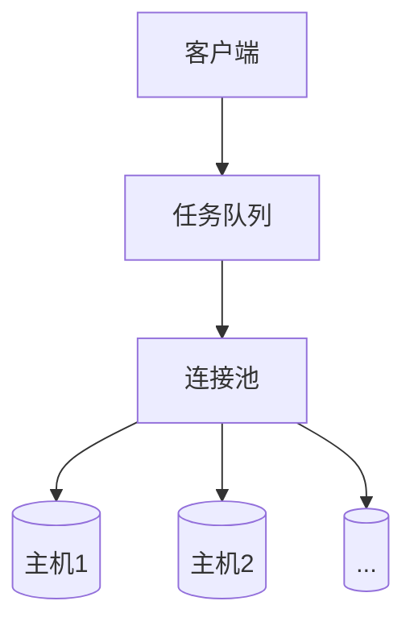

# Goss - 轻量级运维自动化工具

[](https://opensource.org/licenses/MIT)

## 🚀 项目简介
Goss 是面向大规模运维场景的轻量化工具，具有以下核心优势：
- **单文件部署**：下载即用，无需安装依赖
- **高性能连接池**：复用 SSH/SFTP 连接，减少 90% 认证开销
- **极致资源效率**：1MB 内存支持千台主机并发操作
- **符合 RFC4253** 规范的安全通信协议

## ✨ 核心功能
- 📁 **文件传输**：支持批量上传/下载，断点续传
- ⚡ **命令执行**：并行执行远程命令，实时输出收集
- 📜 **脚本分发**：跨主机脚本部署与执行，支持变量替换
- 🔄 **连接池管理**：自动维护活跃连接，智能回收闲置资源

## ⚙️ 快速开始

### 1. 安装
```bash
# Linux amd64
curl -L https://github.com/Suknna/goss/releases/latest/download/goss_linux_amd64 -o /usr/local/bin/goss
chmod +x /usr/local/bin/goss
# Linux arm64
curl -L https://github.com/Suknna/goss/releases/latest/download/goss_linux_arm64 -o /usr/local/bin/goss
chmod +x /usr/local/bin/goss
# MacOS amd64
curl -L https://github.com/Suknna/goss/releases/latest/download/goss_darwin_amd64 -o /usr/local/bin/goss
chmod +x /usr/local/bin/goss
# Linux arm64
curl -L https://github.com/Suknna/goss/releases/latest/download/goss_darwin_arm64 -o /usr/local/bin/goss
chmod +x /usr/local/bin/goss
```

### 2. 基础配置
创建配置文件只需要 `goss init` 即可在当前目录下面生成一个包含所有配置文件的目录。根据目录内的文件内容进行调整即可:
```bash
# goss init
Configuration file templates have been generated:  
play-2025-07-30T092805/hosts.ini, 
play-2025-07-30T092805/tasks.yml, 
play-2025-07-30T092805/goss_config.yaml
# ls -al play-2025-07-30T092805
total 24
drwxr-xr-x@  5 suknna  staff   160  7 30 09:28 .
drwxr-xr-x@ 15 suknna  staff   480  7 30 09:28 ..
-rw-r--r--@  1 suknna  staff   292  7 30 09:28 goss_config.yaml
-rw-r--r--@  1 suknna  staff   202  7 30 09:28 hosts.ini
-rw-r--r--@  1 suknna  staff  1395  7 30 09:28 tasks.yml
```

### 3. 使用示例
```bash
# 执行单次任务
goss exec --type cmd --sudo true --cmd 'df -h'

# 批量执行脚本
goss apply -f tasks.yml
```

## 📊 性能对比
| 指标           | 传统工具 | Goss   |
|---------------|--------|--------|
| 100台连接时间  | 120s   | 12s    |
| 内存占用/千台  | 1GB    | 1MB    |
| 传输速度       | 50MB/s | 80MB/s |

## 🔧 技术架构


## 📜 开源协议
本项目采用 [MIT 协议](LICENSE) 开源，可自由用于商业项目。
